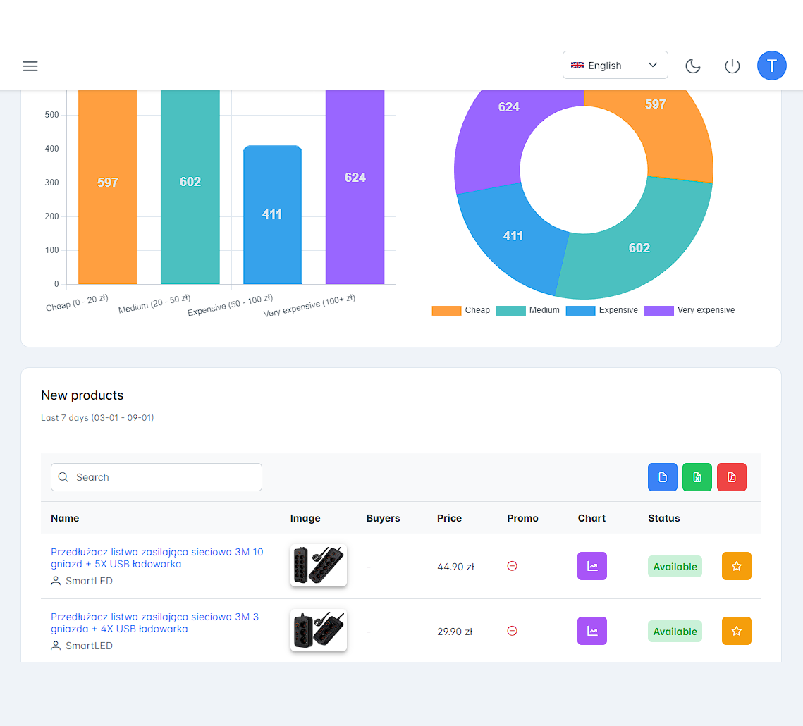

# Price Watch

A web application for users to track prices of products from online stores. It contains the dashboard with various charts and tables to visualize the data as well as the weekly email with the excel spreadsheet containing the price changes and new products.


## Tech stack

Angular, Nest.js, Typescript, TypeORM, MySQL, Firebase
## Screenshots



<!-- ## Database schema

 -->


## Run Locally

Clone the project

```bash
  git clone https://github.com/piotrv1001/price-watch.git
```

Go to the project directory

```bash
  cd price-watch
```

In the first terminal, go to the backend folder

```bash
  cd backend
```

Start the server

```bash
  npm run start
```

In the second terminal, go to the frontend folder

```bash
  cd frontend
```

Start the application

```bash
  npm run start
```

<i>Note: This requires to have a local MySQL database instance.</i>

## Features

- JWT and Firebase Google Auth
- New products
- Price changes
- Price bucket charts
- Favorite products
- Weekly email (setup with cron) with an Excel spreadsheet report

